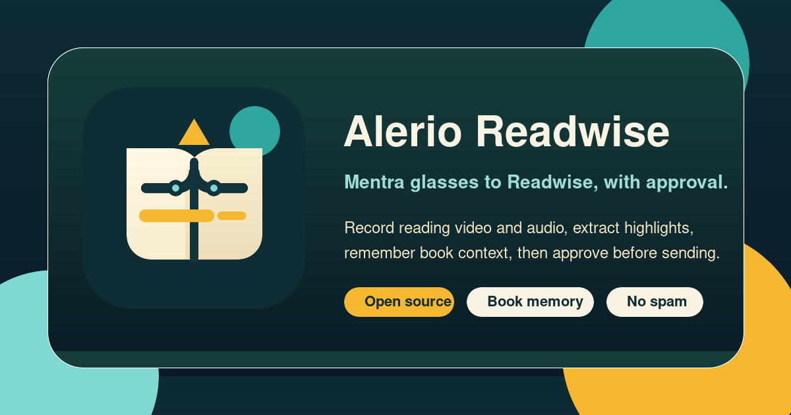

# Alerio Readwise Mini App



Mentra glasses video ingestion for Readwise workflows. The app starts a direct RTMP stream from Mentra Live, records it on your server, remuxes the recording to MP4, extracts an M4A audio track, stores both files, and creates a pending review draft. Nothing is sent to Readwise until a reviewer approves it.

The frame extraction/OCR path is intentionally a separate worker step, and this repo includes that worker. The web process stores video/audio first; the worker then extracts frames, scores and dedupes them, OCRs marked passages, transcribes optional voice notes, resolves book identity, and creates Telegram review candidates.

## Flow

1. Start the mini app in Mentra.
2. Press the glasses button to start direct RTMP recording.
3. Press the glasses button again to stop and save.
4. The server stores the MP4 and optional M4A, then sends a Telegram draft notification if Telegram is configured.
5. The separate worker processes queued recordings to extract frames, transcribe audio, and build candidate highlights.
6. Approve only after the highlight text is correct.

The glasses session path is video-only. Manual video upload remains available at `/webhooks/mentra/book-video`.

## Run

```bash
npm install
npm run setup
npm run doctor
npm run dev:all
```

`npm run setup` copies `.env.example` to `.env` if needed and creates local runtime directories. Edit `.env`, then run `npm run doctor` again until required production checks pass.

For separate production-style processes:

```bash
npm start
npm run worker:video
```

For one queued video draft:

```bash
npm run worker:video:once
```

For checks:

```bash
npm test
npm run check
npm run test:sandbox
```

The web process records/remuxes streams; the worker owns frame extraction/OCR and should be deployed separately for production. `npm run dev:all` runs both together for local testing.

For the complete worker setup, provider choices, and deployment shape, see [Full Pipeline](docs/full-pipeline.md).

## Sandbox Tests

The repo includes `.env.sandbox.example` for safe local/CI tests with fake keys and external providers disabled:

```bash
npm run test:sandbox
```

Sandbox mode runs `doctor`, syntax checks, and the full test suite without calling Mentra, Telegram, Readwise, OpenAI, OpenRouter, or OpenClaw APIs. Real API keys belong only in your local `.env` or in GitHub Actions secrets for your own private integration workflow.

Use Node.js 20, 21, 22, or 23 for local checks. The CI workflow runs on Node 20.

## Required Config

- `MENTRA_PACKAGE_NAME`: Mentra package name, for example `com.alerio.mentra.bookreadwise`
- `MENTRA_API_KEY`: app API key from the Mentra Developer Console
- `PUBLIC_URL`: HTTPS base URL for the app
- `READWISE_REVIEW_TOKEN`: private review/dashboard token in production
- `READWISE_RTMP_INGEST_ENABLED=1`: enables direct RTMP recording
- `READWISE_RTMP_PUBLIC_HOST`: public host the glasses can reach for RTMP ingest
- `READWISE_RTMP_INGEST_SECRET`: stable signing secret for RTMP publish URLs
- `READWISE_MEDIA_TOKEN_SECRET`: signing secret for private Telegram media links
- `READWISE_READING_CONTEXT_PATH`: optional JSON path for active/recent book context; defaults to `data/reading-context.json`
- `READWISE_APPROVAL_ENABLED=1`: allows Telegram approval callbacks to write approved highlights when live writes are also enabled
- `READWISE_TELEGRAM_FORWARD_TOKEN`: shared secret for your Telegram webhook forwarder

`READWISE_LIVE_WRITES=0` is the safe default. Set `READWISE_TOKEN` and switch `READWISE_LIVE_WRITES=1` only after approval tests pass.

## Reading Context

Readwise highlights need a real book title and author. This app never sends `Unknown Book` to Readwise: candidate approval is blocked until title and author are known.

When the worker confirms a book title and author from voice or vision, it saves that book to reading context with first/last seen timestamps, recent pages, recent draft ids, and a `seenCount`. Later recordings resolve book identity in this order:

1. Confirmed title/author from voice or vision.
2. Active-book fallback when the new clip has no title/author or a close match.
3. Reading-history fuzzy match when OCR/voice has a partial title or author and one prior book clearly wins.
4. Approval blocked when no reliable book can be chosen.

Fallbacks are marked in draft metadata and Telegram review cards as `reading_context` or `reading_context_history`, so reviewers can see when the book came from memory instead of the current clip.

## Stream Storage

Recorded stream drafts use this shape:

- `sourceKind: "book_video"`
- `target: "readwise"`
- `storage`: stored MP4 metadata
- `audioStorage`: stored M4A metadata when audio extraction succeeds
- `processing.mode: "queued"` until the worker processes the recording
- `frameUrls`: populated only by the separate worker
- `metadata.bookIdentity`: title/author plus source, for example `voice_transcript`, `vision_ocr`, `reading_context`, or `reading_context_history`

Private media links are served from `/media/private/:filename` and can be opened with either a review token/cookie or a short-lived `mediaToken` query parameter.

## API

- `POST /webhooks/mentra/book-video`
- `POST /webhooks/mentra/book-page` for legacy/manual page drafts
- `POST /webhooks/mentra/book-page/:id/process-video`
- `POST /webhooks/mentra/book-page/:id/approve`
- `POST /webhooks/mentra/book-page/:id/reject`
- `GET /review`
- `GET /api/highlights`
- `GET /api/media`
- `GET /api/sessions`
- `GET /health`

## Notes

- Do not commit `.env`, `data/`, recordings, pending highlight stores, or Telegram/Readwise/Mentra tokens.
- `data/reading-context.json` can contain private reading history. Keep it out of git unless you intentionally export a redacted sample.
- RTMP ingest needs a reachable TCP port. If a reverse proxy is in front of HTTP, RTMP still needs direct TCP routing.
- The app defaults to a long-stream profile for reliability: 1280x720, 30 fps, 2.5 Mbps video, and 128 kbps audio. For short high-quality tests, override `READWISE_STREAM_*` to 1920x1080 and a higher bitrate.
